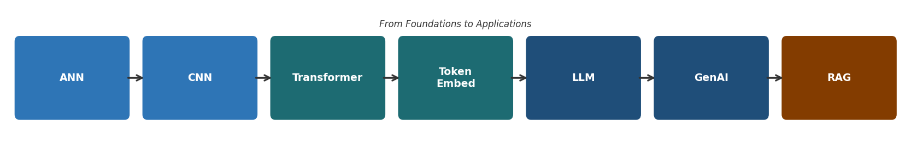
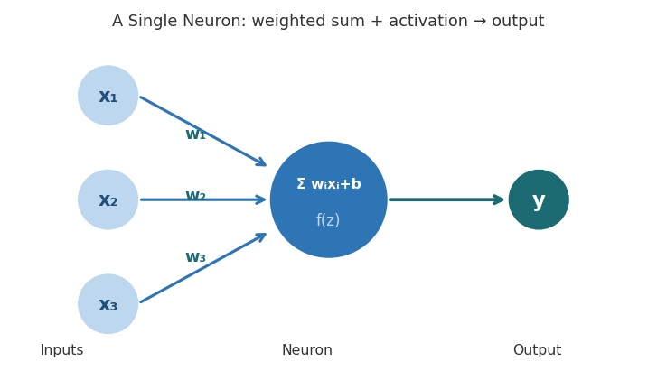
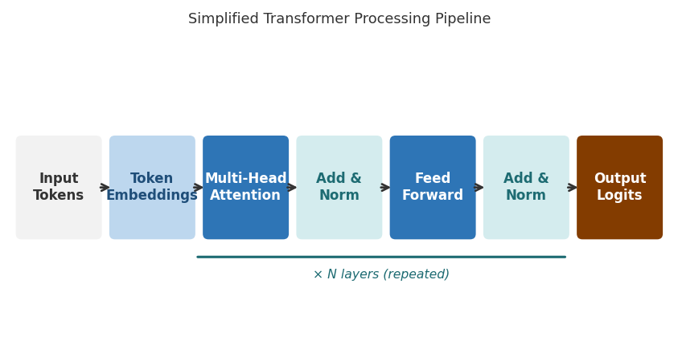
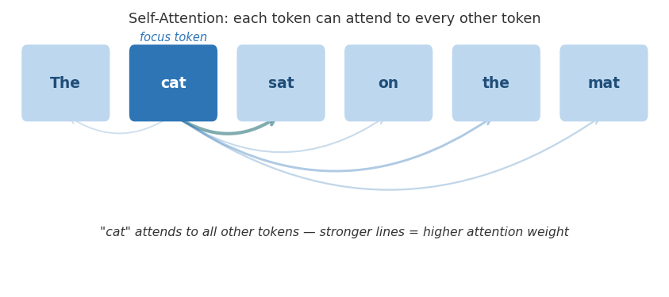
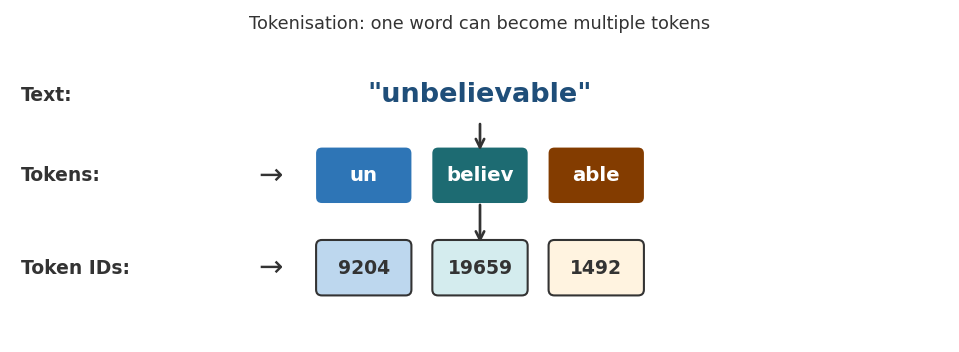
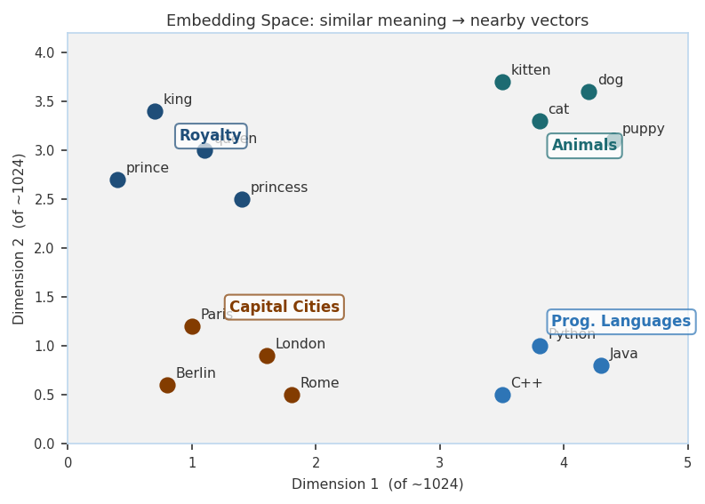
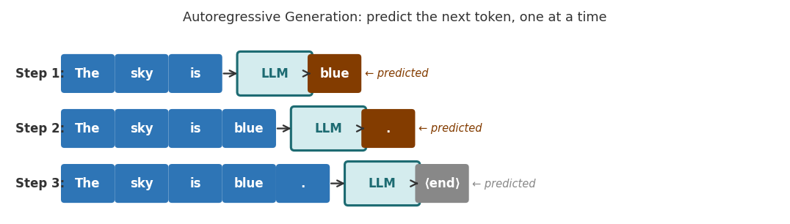
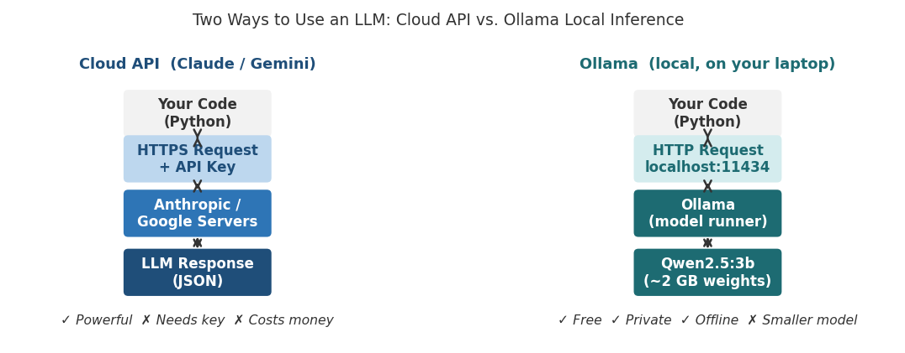
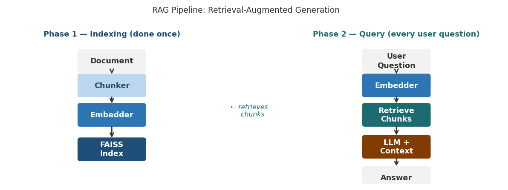
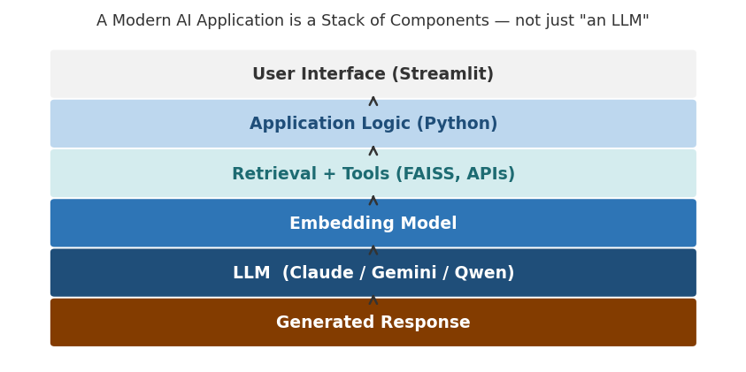

*AI-Assisted Software Development · Atlas University · Fall 2026–2027*

*Week 1 Pre-Reading · Prof. Dr. Vedat Coşkun*

# Technical Background: Modern AI · LLMs · Generative AI

ANN · CNN · Transformer · Embeddings · LLM · GenAI · Local Inference · RAG

### 📖 How to use this document

Read this document before you attend the first class. The in-class lecture will be a 20-minute summary of exactly this material, so if you arrive having read it once, you will follow the lecture immediately. You are not expected to memorise formulas or to understand every detail on first reading. Your goal is to build a working mental model of how modern AI systems are assembled from components.

This is one of three pre-reading documents. "Development Environment and Tools" (Doc 3) covers the development environment and every tool you will use this term. In that document you will meet the Python language, the VS Code editor, GitHub for storing and sharing code, Streamlit for building a web interface, the Claude and Gemini APIs (an API, or application programming interface, is the channel through which your program sends a request to a service and receives a reply), Ollama for running models on your own machine, FAISS for searching vectors, pytest for testing, Ragas for evaluating answers, Selenium for driving a web browser, and the rest of the tool set. "Working with AI Tools" (Doc 4) covers the same tools as products: it explains what they cost, how they ration you, and the working habits that keep them affordable. Read all three before the first session. This document is about the ideas; Doc 3 is about the setup; Doc 4 is about the money and the habits.

## 1. Why Do You Need This Background?

Modern AI applications are not single algorithms. This is true of ChatGPT, of a coding assistant, of a system that answers questions about documents, and of a tool that helps a developer write software. They are all systems assembled from several specialised components. You do not need to become a deep-learning researcher, but you do need to understand what each component does, why it exists, what goes in, and what comes out. The reason is simple: in this course you will be building exactly these systems.

The figure below shows the conceptual progression this document follows. It starts from the neural network foundation and ends at the full application stack you will build in this course.



*Figure 1 — From foundational architectures to modern AI applications*

## 2. Artificial Neural Networks (ANN)

An Artificial Neural Network (ANN) is a computational model that is inspired loosely by biological neural networks (the networks of nerve cells in a brain). It consists of layers of interconnected units called neurons. Each neuron applies a weighted sum to its inputs, and then it applies an activation function (a simple mathematical function that decides how strongly the neuron passes its result on).



*Figure 2 — A single neuron applies a weighted sum then an activation function*

### What does a neuron compute?

```
z = Σ wᵢxᵢ + b y = f(z)
```

In this formula, xᵢ is an input value, wᵢ is a learned weight (a number that says how much that input counts), b is a bias (a constant that shifts the result up or down), and f(·) is an activation function such as ReLU, sigmoid, or GELU (three common choices of activation function; their names are not important for this course). The important point is that the network learns the weights from data. You do not write them by hand.

### How does an ANN learn?

During training the network makes predictions and compares them with the correct answers. From that comparison it computes a loss (a single number that measures how wrong the predictions were). It then uses backpropagation (a procedure that works backwards through the layers and calculates how much each weight contributed to the error) to decide how each weight should change. An optimiser (the algorithm that actually adjusts the weights, for example gradient descent or Adam) then updates the weights. This cycle repeats many times across a large dataset.

- The cycle is as follows: the network is fed training data, it makes a prediction, the loss is measured, the error is backpropagated, the weights are updated, and the whole process repeats.

## 3. Convolutional Neural Networks (CNN)

A standard ANN can process any structured input, but images have a specific property: nearby pixels are strongly related. CNNs exploit this property by using small learned filters (tiny grids of weights, each only a few pixels wide) that slide across the image and detect local patterns.

### What does a CNN learn?

- The early layers learn to detect edges, corners and simple textures.

- The middle layers learn to detect curves, shapes and local patterns.

- The deep layers learn to detect object parts and high-level concepts.

CNNs are the dominant architecture for computer vision tasks (tasks in which a program must understand the content of images). You will not build CNNs in this course, but understanding them helps you appreciate why a general ANN was not enough for images, and why a different specialisation was later needed for language.

## 4. Why Transformers?

Language is different from images. Words depend on other words that may be far away in a sentence. Earlier architectures, known as recurrent networks, processed text step by step, one word after another. This made it hard for them to capture long-range relationships, and it made them slow to train in parallel.

The Transformer architecture, introduced by Vaswani et al. in 2017 in the paper "Attention Is All You Need", replaced the sequential step with an attention mechanism (a way of letting every position in a sequence look at every other position at the same time and decide which ones matter). This single change enabled the modern LLM era.

> **"Attention Is All You Need" — Vaswani et al., NeurIPS 2017. If you read one AI paper in your life, read this one. Sections 1 and 3 are sufficient for this course.**



*Figure 3 — Simplified Transformer pipeline: tokens flow through attention and feed-forward layers, repeated N times*

## 5. Self-Attention

Self-attention is the core operation of the Transformer. It allows each token in a sequence (a token is a small piece of text; §6 explains tokens in detail) to attend to any other token in the same sequence. To "attend to" a token means to be influenced by it.

### Query, Key, and Value

For each token, the attention mechanism constructs three vectors (a vector is simply an ordered list of numbers): a Query (Q), a Key (K), and a Value (V). A helpful analogy is a visit to a library. Imagine that you walk into a library. The query describes what you are looking for. Each book on the shelves has a key, which is a label describing its topic. The value is the book's actual content. Attention scores how well your query matches each key, and then it retrieves a weighted combination of the values.

```
Attention(Q, K, V) = softmax(QKᵀ / √dₖ) · V
```

You do not need to memorise this formula. The key intuition is that attention computes which pieces of information should influence each other, and by how much. (The softmax in the formula is a function that turns a list of raw scores into a list of weights that add up to one.)



*Figure 4 — "cat" attends to all other tokens; thicker lines indicate higher attention weight*

### Multi-Head Attention

In practice, Transformers run multiple attention operations in parallel. Each of these parallel operations is called a "head". Each head can learn a different kind of relationship: one head might track grammatical agreement, while another head might track which earlier noun a pronoun refers to. The outputs of all the heads are then combined.

## 6. Tokens and Tokenisation

Before a language model can process text, the text must be converted into tokens. A token is not necessarily a complete word. Depending on the tokeniser (the program that performs this splitting), a word may become one token or several subword pieces.

- The word "unbelievable" might become ["un", "believ", "able"], which is three tokens.

- Short common words such as "the" or "is" are typically one token each.

- Numbers and special characters are tokenised in ways that differ from one model to another.



*Figure 5 — "unbelievable" splits into 3 tokens, each mapped to a numerical ID*

After tokenisation, each token is mapped to a numerical ID (a whole number that stands for that token). The model never sees raw text; it sees sequences of integers. These sequences are the input to the Transformer.

## 7. Embeddings

An embedding is a learned numerical vector that represents an object in a high-dimensional space (a space with hundreds or thousands of coordinates instead of the two or three we can draw). The object can be as small as a word or a sentence, or as large as a whole document; it can also be an image or a piece of code.

```
"Artificial intelligence is powerful." → [0.21, −0.17, 0.83, …, 0.42] (1024 numbers)
```

### Why are embeddings important?



*Figure 6 — Similar concepts cluster together in embedding space (2 of ~1024 dimensions shown)*

Embeddings encode meaning, not just spelling. Two sentences with the same meaning but different words will have similar embeddings; their vectors will point in roughly the same direction in the high-dimensional space. This property makes several things possible:

- It enables semantic search, in which you find documents by their meaning rather than by the exact keywords they contain.

- It enables recommendation systems, which suggest items that are similar in meaning to the ones a user already liked.

- It enables document retrieval for RAG pipelines (RAG is explained in §13).

- It enables clustering (grouping similar items together) and duplicate detection.

### Measuring similarity

Once texts are represented as vectors, their similarity is measured using cosine similarity. Cosine similarity compares the direction of two vectors rather than their magnitude (their length). A high cosine similarity means that the two texts have similar meaning.

```
cos(θ) = (A · B) / (|A| · |B|)
```

### Embedding models vs LLMs

An embedding model and an LLM are different tools. An embedding model converts text into a vector for retrieval. An LLM generates new text. In a RAG system you use both: the embedding model finds the relevant documents, and the LLM generates the final answer.

|                     | Embedding Model                 | LLM                   |
| ------------------- | ----------------------------------- | ------------------------- |
| **Primary purpose** | It represents meaning for retrieval. | It generates language. |
| **Output**          | It produces a vector of numbers.    | It produces tokens, that is, text. |
| **Typical use**     | It is used for semantic search and for the retrieval step of RAG. | It is used for chat, for writing code, and for summarisation. |

## 8. Large Language Models (LLMs)

A Large Language Model (LLM) is a Transformer-based model that has been trained on a very large collection of text and/or code. It learns a probability distribution (a set of probabilities, one for each possible outcome) over which token is likely to come next, given everything that came before.

### How does an LLM generate text?

LLMs generate text autoregressively, which means that they predict the next token, append it to the text, predict again, and repeat until a stopping condition is met. The model does not write a full sentence at once. It writes one token at a time, and each time it conditions on everything that came before.

Which token is selected? The model outputs a probability distribution over its entire vocabulary. Depending on the sampling strategy (the rule used to pick a token from that distribution, controlled by settings such as temperature and top-p, which §9 explains), the selected token may be the most probable one or a random sample from the distribution.



*Figure 7 — Each step the LLM predicts the next token; the prediction is appended and the process repeats*

### Training vs. inference

Training an LLM means learning its billions of parameters (its weights and biases) on massive datasets. This costs millions of dollars and takes weeks on thousands of specialised chips. In this course you will only do inference (using an already-trained model to produce output): you will send prompts and receive responses from models that someone else has already trained.

|                    | Training                         | Inference                 |
| ------------------ | ------------------------------------ | ----------------------------- |
| **Purpose**        | It learns the model's parameters. | It uses the learned parameters. |
| **Input**          | A very large dataset.                | Your prompt.                  |
| **Main operation** | Repeated optimisation (backpropagation). | One forward pass followed by token sampling. |
| **Typical cost**   | Extremely high (millions of dollars). | Much lower, typically cents per call. |

## 9. Context Windows, System Prompts and Sampling

Three practical controls shape what an LLM does with your request. You will use all three every week of this course.

### The context window

An LLM has no memory between calls. Everything it knows about the current conversation must be sent again, every time. Your application must send the system prompt again, it must send the full conversation history again, it must add any documents it has retrieved, and only then does it add the new question. The context window is the maximum number of tokens that this whole bundle may contain.

This is the single most important practical constraint in LLM application design. A chat that goes on long enough will eventually exceed the window, and a large document cannot simply be pasted into the prompt. Both problems have the same answer: send less, but send the right part. That is exactly what RAG does (see §13).

> **The model does not "remember" your earlier messages. Your application re-sends them. If you do not send them, they never happened.**

### The system prompt

A system prompt is a separate instruction that sets the model's role and rules before the user says anything. Consider the following text: "You are a legal assistant. Answer only from the provided documents. If the answer is not in them, say you do not know." That text is a system prompt, and it changes the model's behaviour far more than politely asking for the same thing in the user message would.

Writing good system prompts is a real engineering skill, and it is the difference between an application that behaves predictably and one that does not. You will write and compare several of them in Week 3.

### Temperature and sampling

At each step the model produces a probability distribution over its vocabulary. How a token is picked from that distribution is your choice. A low temperature makes the model pick high-probability tokens almost every time, so its output is repeatable and conservative. A high temperature flattens the distribution, so the output is more varied and more surprising.

- Use a low temperature (0–0.3) when you want a factual answer, when you are generating code, when the output must follow a fixed structure, or whenever you need the same answer twice.

- Use a high temperature (0.7–1.0) when you are brainstorming, when you are writing creatively, or when you want several different alternatives.

If you ask the same question twice and get different answers, this is why. It is not a malfunction.

## 10. Generative AI

Generative AI (GenAI) is the broad category of AI systems that can generate new content. An LLM is one important type of GenAI, but the category is wider:

- For text and code, the generators are LLMs, such as Claude, Gemini, GPT-4 and Qwen.

- For images, the generators are diffusion models (models that start from random noise and gradually refine it into a picture), such as Stable Diffusion, DALL·E and Midjourney.

- For audio, the generators are speech synthesis systems and music generation systems.

- For video, the generators are the video generation models that are now emerging.

In this course you will work with text and code generation, and specifically with Claude, Gemini, and the models hosted by Ollama. Understanding that GenAI is a broader landscape helps you put the tools you are using into context.

## 11. Running Models Locally: Ollama and Qwen

So far everything described here runs on somebody else's computer. When you call Claude or Gemini, your text travels over the internet to a data centre, a very large model processes it there, and the answer comes back. That is cloud inference. It is powerful, but it needs an API key (a secret string that identifies your account to the service), it costs money per call, and your data leaves your machine.

There is another option. A smaller model can run on your own laptop, with no internet connection and no API key. Ollama is the program that makes this practical: you install it once, you download a model, and Ollama exposes a local server at localhost:11434 (an address on your own computer, reachable only from that computer) that your Python code talks to exactly as it would talk to a cloud API.



*Figure 10 — The same Python code, two very different paths: cloud API versus local inference*

### Qwen

Qwen is a family of open-weight language models developed by Alibaba's Qwen team. "Open-weight" means that the trained parameters are published, so anyone may download and run them. Qwen is not a new architecture; it is a Transformer, exactly as described in §4 and §5 of this document. You will use Qwen models through Ollama.

### Why a 3-billion-parameter model fits on a laptop

A model with 3 billion parameters, stored at full precision, would need roughly 12 GB of memory. Most laptops cannot spare that much. Quantisation solves the problem: each parameter is stored using fewer bits, typically 4 instead of 32, which shrinks the model to around 2 GB at a small cost in quality. Every model you download through Ollama is quantised by default.

This is why model size matters to you personally. Pick the largest model that your machine can hold in memory. The same rule appears in Doc 4 and on the Week 1 slides:

- If your machine has 16 GB of RAM or more, use qwen2.5:7b, which takes about 4.7 GB on disk. This is the size the course assumes.

- If your machine has 8 to 16 GB of RAM, use qwen2.5:3b, which takes about 1.9 GB.

- If your machine has 4 to 8 GB of RAM, use qwen2.5:1.5b, which takes about 1 GB.

- If your machine has less than 4 GB of RAM, use qwen2.5:0.5b, which takes about 0.4 GB.

No graphics card is required. On a modern CPU a 3B model produces roughly 5 to 15 tokens per second. That is fast enough for short answers, and slow enough that you will feel it on long ones. In Week 3 you will measure this speed yourself on two different model sizes and write down what you observe.

### Which should you use?

Neither option is simply better. A cloud model gives you far more capability; a local model gives you privacy, zero cost, and offline operation. Real applications often use both. They use a local model for routine work and a cloud model for the hard cases. In this course your chatbot will support both behind a single interface, and switching between them will be one line of code.

|                    | Cloud API       | Ollama (local)           |
| ------------------ | ------------------- | ---------------------------- |
| **Runs on**        | It runs on the provider's servers. | It runs on your laptop.  |
| **Needs internet** | Yes                 | No                           |
| **API key**        | An API key is required. | No API key is required.  |
| **Cost**           | You pay per call.   | It is free after the download. |
| **Your data**      | Your data leaves your machine. | Your data never leaves your machine. |
| **Capability**     | Its capability is much higher. | The model is smaller and its quality is lower. |

## 12. Hallucination

> **An LLM can generate a confident-sounding statement that is factually incorrect. This is called a hallucination.**

The model is not lying, because it does not have intentions. It is generating text according to learned patterns and the current context. It has no mechanism that automatically verifies every claim against an authoritative source.

This has direct consequences for software engineering. Any system that relies on LLM output for decisions must be designed with this limitation in mind. In this course, the ai_log.md that you submit every week asks you to evaluate what the AI got wrong and what you corrected. That evaluation is the professional discipline this course is training you in.

## 13. Retrieval-Augmented Generation (RAG)

The core limitation of a standalone LLM is that it can only work with what it learned during training plus what you put in the current prompt. It cannot access private documents, it cannot access a company's internal database, and it cannot access information that was added after its training cutoff (the date after which no text was included in its training data).

RAG solves this by adding a retrieval step before generation. This section assumes that you have read §7 on embeddings.

- The documents are split into chunks (short passages of a fixed approximate size) and each chunk is converted into an embedding.

- The embeddings are stored in a vector database (a database designed to store vectors and find the ones closest to a given vector), or in an in-memory index such as FAISS.

- When a user asks a question, the question is also converted into an embedding.

- The document chunks whose embeddings are most similar to the question's embedding are retrieved.

- The retrieved chunks are given to the LLM as context in the prompt.

- The LLM generates an answer that is grounded in the retrieved content.



*Figure 8 — RAG has two phases: indexing (done once) and querying (every user question)*

### Why does RAG help?

Without RAG, an LLM relies only on its training knowledge. With RAG, you can supply current, private, or domain-specific information at inference time, and you can do so without retraining the entire model. In Week 6 of this course you will build a RAG pipeline from scratch.

## 14. The Modern AI Application Stack

A key misconception among beginners is to treat a model as if it were the complete application. In practice, a production AI application looks more like the following chain:

```
User Interface → Application Logic → Retrieval + Tools → Embedding Model + Vector Index → LLM → Response
```

The model is one component in a larger software system, and designing that system is exactly the engineering challenge this course addresses.



*Figure 9 — A modern AI application is a stack of components; the LLM sits in the middle, not at the top*

| Architecture | Main Strength                              | Typical Use               |
| ---------------- | ---------------------------------------------- | ----------------------------- |
| **ANN**          | It learns general nonlinear relationships.     | It is used for tabular and other structured data. |
| **CNN**          | It learns local and hierarchical spatial patterns. | It is used for images and computer vision. |
| **Transformer**  | It learns relationships across sequences using attention. | It is used for language, code, and multimodal AI (AI that handles text and images together). |

## 15. Summary: Concepts to Know Before Class

After reading this document you should be able to explain each of the following in one or two sentences. If you cannot, re-read the relevant section.

| Concept        | Key Idea                                                                                                    |
| ------------------ | --------------------------------------------------------------------------------------------------------------- |
| **ANN**            | A general neural-network foundation that learns relationships through trainable weights and biases.             |
| **CNN**            | A neural architecture that uses local filters to learn hierarchical spatial features, which makes it ideal for images. |
| **Transformer**    | An attention-based architecture that models relationships among all elements of a sequence in parallel.         |
| **Token**          | The smallest unit a language model processes. Words can be split into multiple tokens by the tokeniser.         |
| **Embedding**      | A learned numerical vector that places semantically similar items close together in high-dimensional space.     |
| **LLM**            | A large Transformer-based model trained on vast text data; it generates the next token, one at a time.          |
| **Generative AI**  | A broad class of AI systems that produce new content; the content may be written (text or code), visual (images or video) or audible (audio). |
| **Hallucination**  | When an LLM generates a confident-sounding statement that is factually incorrect.                               |
| **RAG**            | Retrieval-Augmented Generation: the system retrieves relevant documents, supplies them as context, and then generates. |
| **Context window** | The maximum number of tokens one request may contain; the system prompt, the history, the documents and the question all count together. |
| **System prompt**  | A separate instruction that sets the model's role and rules before the user speaks.                             |
| **Temperature**    | Controls how adventurously the next token is sampled. A low value gives repeatable output; a high value gives varied output. |
| **Quantisation**   | Storing parameters with fewer bits so that a large model fits in ordinary memory, at a small cost in quality.    |
| **Ollama**         | A program that runs open-weight models locally on your own machine, with no API key, no internet and no cost.   |

### Where These Concepts Appear in the Course

Nothing in this document is theory for its own sake. Every concept here becomes something you build, measure or debug in a specific week.

| Concept                                      | Week       | Where you meet it                                          |
| ------------------------------------------------ | -------------- | -------------------------------------------------------------- |
| **Transformers, attention, tokens**              | **Week 1**     | They are the conceptual foundation, covered in the lecture and in this document. |
| **System prompts, context window, temperature**  | **Week 3**     | You write them and compare them in your chatbot.               |
| **Local inference — Ollama, Qwen, quantisation** | **Week 3**     | You install a local model, measure it, and benchmark it on your own machine. |
| **Embeddings and cosine similarity**             | **Weeks 3, 6** | You first run a similarity experiment, and later you use them for document retrieval. |
| **LLM API integration**                          | **Week 5**     | It is the core AI feature of your own project.                 |
| **Retrieval-Augmented Generation**               | **Week 6**     | You build it from scratch: you chunk the documents, index them, retrieve the relevant chunks, and generate the answer. |
| **Hallucination and verification**               | **Every week** | You record it in ai_log.md every week, and you measure it with Ragas in Week 9. |
| **AI ethics and human-in-the-loop**              | **Week 11**    | You carry out a security audit and a responsible-use review.   |

### 💬 Before You Come to Class — Reflection Questions

You do not need to write formal answers. Think about these questions so that you arrive with something to say and something to ask.

- What is the difference between training a model and using (inferring with) a model? Why does this distinction matter for you as an application developer?

- Why can a Transformer capture the relationship between the first and last word of a long sentence better than a recurrent network can?

- A friend says "ChatGPT is just an LLM." What would you add or correct after reading this document?

- You are building a Q&A assistant for Turkish law. Why might a plain LLM give unreliable answers? How would adding RAG improve the situation?

- An LLM writes a confident explanation of a legal precedent that does not exist. Is the model broken? Who is responsible for catching this in a production system?

- Your application must process confidential student records. Would you send them to a cloud API or run a local model? What do you gain, and what do you give up?

### References

- Vaswani et al., "Attention Is All You Need," NeurIPS 2017. https://arxiv.org/abs/1706.03762

- Alammar, J., "The Illustrated Transformer," 2018. https://jalammar.github.io/illustrated-transformer

- Karpathy, A., "Intro to Large Language Models," YouTube, 2023. https://youtu.be/zjkBMFhNj_g — watch the first 30 minutes

- Brown et al., "Language Models are Few-Shot Learners" (GPT-3), NeurIPS 2020. https://arxiv.org/abs/2005.14165 — read the abstract and Section 1

- Ji et al., "Survey of Hallucination in Natural Language Generation," ACM Computing Surveys, 2023. https://arxiv.org/abs/2202.03629 — Sections 1–3

- Lewis et al., "Retrieval-Augmented Generation for Knowledge-Intensive NLP Tasks," NeurIPS 2020. https://arxiv.org/abs/2005.11401 — Sections 1–2

- Qwen Team, "Qwen3 Technical Report," 2025. https://arxiv.org/abs/2505.09388 — optional background

*This document covers the concepts. "Development Environment and Tools" (Doc 3) covers the environment and the tool set; "Working with AI Tools" (Doc 4) covers prices, limits and working habits. Read all three before the first session.*
