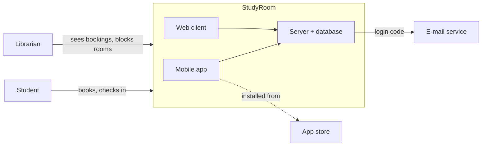

# Project Proposal

**AI-Assisted Software Development · Atlas University · Fall 2026–2027**

| | |
|---|---|
| **Student** | *student number · first name · last name* |
| **Section** | *en / tr* |
| **Project** | *the title from §1* |

<!--
WHAT A PROPOSAL IS FOR
A proposal convinces a busy reader — an instructor, an investor, a manager — in five
minutes that you know what you are building, for whom, and why it can be finished. It is
also a promise to yourself: every week from now on the checker reads it, and in December
you defend the product against it. Write it so that a classmate who has never heard of
your idea could explain it to someone else after one reading.

HOW TO WRITE IT
- Order: write §3 Problem first, then §4 Solution, then §5–§7. Write §2 Summary and
  §1 Title LAST — you can only summarise what you have already written.
- Plain and specific. Short sentences. Names, numbers, times, places. No marketing words:
  "innovative", "seamless", "revolutionary", "user-friendly" say nothing.
- One product. If you catch yourself writing "and also…", you have two projects; keep one.
- Small enough to finish. You have ten weeks, alone, for a mobile app, a web client and a
  server on a public store. A product with three features that ship beats one with ten that
  do not. You can always add in Week 10; you can never subtract in Week 11.
- AI may help you draft. Then read every sentence and ask: is this true about MY product?
  Assistants love to add features you never asked for; delete them.

HOW TO READ THE COMMENTS BELOW
Each section has WHY (what the section is for), WHAT (what to write), CHECK YOURSELF
(questions to ask before you move on), and a WEAK and a STRONG example. All examples
describe one invented project, "StudyRoom" (booking a study room in the university
library), so you can see how the sections connect. It is not your project and not text to
copy — write about yours. Comments are invisible on GitHub and the checker does not count
them, so you may leave them in place.

RULES
- Keep every heading exactly as written; the checker finds sections by heading.
- Each heading carries an IDEAL length in parentheses ("about 600 characters"). It is a
  guide, not a limit: it tells you how much a good answer usually needs. Longer is allowed
  and is never marked down by the checker — but say more only if it adds something; a
  reader values the short, specific version. The count is the text under the heading,
  spaces included, not the heading and not the comments. For scale: this paragraph is about
  450 characters.
- DIAGRAMS: every diagram in this course is written in Mermaid, inside a mermaid fenced
  block, in the markdown file itself. No images, no links to external tools. GitHub renders
  Mermaid on the page and the checker parses it; a diagram that does not parse is shown as
  raw text on GitHub and fails the check. The block must appear directly under the heading
  that asks for it.
-->

---

## Part A — What you will build (Week 2)

### 1. Title (about 80 characters)
<!--
WHY: the first thing anyone sees — in the store, on the class board, on your poster.
WHAT: a short product name, then a dash and a few words that say what it does. Not a
sentence, not the course name, not "App".
CHECK YOURSELF: would a stranger know from the title alone what the product is for?
Is the name easy to say and to search for?
WEAK:   "AIASD Project" · "Student App" · "A Mobile Application That Helps Students Study Better"
STRONG: "StudyRoom — book a library study room in ten seconds"
-->

### 2. One-paragraph summary (about 400 characters)
<!--
WHY: many readers stop here. If they read nothing else, they must still know the project.
WHAT: one paragraph, three to four sentences, answering in this order:
  1. what it is (a mobile app and a web client for …);
  2. who it is for (the specific people, not "everyone");
  3. what it does (the two or three main things a user can do);
  4. optionally, what makes it different.
No history, no motivation, no technologies — those come later.
CHECK YOURSELF: does every sentence say something a reader could not guess? Could you
read it aloud in twenty seconds?
WEAK:   "This project aims to improve student life using modern technologies and AI. It will
         be a useful and innovative application for everyone at the university."
STRONG: "StudyRoom is a mobile and web app for Atlas University students who need a quiet
         room in the library. It shows which of the twelve study rooms are free now and in
         the next hours, lets a student book one for up to two hours, and releases the room
         automatically if nobody checks in within fifteen minutes."
-->

### 3. Problem (about 600 characters)
<!--
WHY: a product is only as good as the problem it solves. A vague problem produces a vague
product; a precise one tells you what to build and how to test it.
WHAT: answer four questions —
  - WHO has the problem? A specific group ("second-year students during exams"), not "people".
  - WHEN and WHERE does it happen? Describe one concrete situation, step by step.
  - HOW do they cope today? The workaround: a paper list, a WhatsApp group, a spreadsheet.
  - WHAT does it cost them? Time, money, mistakes, stress — with a number if you have one,
    and where the number comes from (you counted, you asked ten classmates, a source).
Do NOT describe your solution here. The word "app" should not appear in §3.
CHECK YOURSELF: could a classmate picture the situation? Is there at least one number?
Would the people who have this problem agree with your description?
WEAK:   "Students have difficulties finding places to study. This is a big problem at many
         universities and it causes stress and wasted time."
STRONG: "In exam weeks the twelve study rooms are booked on a paper list at the front desk
         that opens at 08:30. Students queue from 08:00. A student who arrives at 10:00
         walks up four floors to find every room taken — although, when I counted on three
         mornings, three or four rooms stood empty because the people who wrote their names
         never came. Nobody can see the list from outside the library, so the walk is wasted
         every time, and the rooms that are free are not used."
-->

### 4. Solution (about 600 characters)
<!--
WHY: this is the promise. Everything you build later — requirements, design, tests — must
trace back to a sentence here, and nothing important may be missing from it.
WHAT: what the product DOES about the problem in §3.
  - Three to five things a user can do, written as verbs: "books a room", "sees free
    slots", "gets a reminder". Features, not adjectives — "fast" and "easy" are not features.
  - Who does each thing, if there is more than one kind of user (student / librarian).
  - How each one answers a part of §3: the queue, the empty rooms, the wasted walk.
  - Then ONE sentence on what it deliberately does NOT do. It keeps the project small
    enough to finish, and it becomes the scope line of your SRS.
CHECK YOURSELF: does every feature answer something in §3? Is there anything in §3 that no
feature answers? Could you build all of it in ten weeks, alone?
WEAK:   "A smart, user-friendly platform that solves all booking problems using AI, with
         chat, payments, maps, social features and much more."
STRONG: "A student logs in with a university e-mail code, sees the rooms as free or busy for
         today, books a free slot of up to two hours, and checks in with the QR code on the
         door. An unclaimed booking is released after fifteen minutes and the room shows as
         free again, so the empty rooms get used. The librarian sees the day's bookings on
         the web and can block a room for cleaning. StudyRoom does NOT book computers or
         group spaces, take payments, or replace the library's own catalogue."
-->

### 5. How it works (about 600 characters + one diagram)
<!--
WHY: the reader wants to know that you have thought about how the parts fit — before you
spend ten weeks building them. It is also the first sketch of the design you write next week.
WHAT: the approach in plain words, one or two sentences for each of these:
  - the MOBILE app: who uses it and for what;
  - the WEB client: who uses it and for what — often a different user (an admin, a teacher,
    a shop owner), sometimes the same user on a laptop;
  - the SERVER: what it keeps and what it decides (rules, timers, permissions);
  - the DATA: which database, hosted where;
  - LOGIN: every project logs in with an e-mail code or OTP — say who sends the code;
  - AI: where it is used inside the product, if at all (the course chatbot comes later
    and does not count here).
The words mobile, web and server must all appear; the checker looks for them.
CHECK YOURSELF: for each feature in §4, can you say which part does it? Does any client
store data that only the server should hold?
WEAK:   "The app uses a backend and a database and the frontend shows the data. AI is used
         to make it smart."
STRONG: "Students use the mobile app to see and book rooms and to check in. The librarian
         uses the web client to see today's bookings and to block a room. The server holds
         rooms, bookings and users in PostgreSQL, releases unclaimed bookings every minute,
         and sends the login code through an e-mail service. Both clients talk only to the
         server's REST API; neither keeps data of its own. No AI inside the product."

Then a SYSTEM CONTEXT DIAGRAM directly under this comment. It shows your whole system as
ONE box (mobile + web + server inside it) and, around it, everything outside that it talks
to: each kind of user, the e-mail/OTP service, any third-party API (maps, payments, an AI
model), the app store. Label the arrows with what flows: "books a room", "login code". It
answers one question: what is inside my system and what is not? The block below is an
example: replace every line of it and delete the EXAMPLE line, or the checker treats it as
missing.
-->

### 6. Technologies (about 300 characters)
<!--
WHY: a stack you have not checked is the most common reason a project stalls in Week 6.
WHAT: one line per layer, naming the actual tool: mobile, web, server, database, hosting,
login e-mail, store, AI. Only things you will install and use this term. Before you write a
line, check that it runs on YOUR laptop and phone — AI_PLATFORMS_AND_STORES tells you what
each combination allows; native or hybrid is your choice.
CHECK YOURSELF: have you installed or at least run a "hello world" in each one? Is the
hosting free, or do you know the price? Does the store you have in mind accept this stack?
WEAK:   "React, Python, AI, cloud, database."
STRONG: "Mobile: Flutter (Android first). Web: Flutter web. Server: FastAPI (Python 3.12).
         Database: PostgreSQL on Render (free tier). Login e-mail: Resend. Store: Google
         Play. AI: none in the product; the course chatbot runs on Ollama."
-->

### 7. Success criteria (about 400 characters)
<!--
WHY: in Week 12 someone will ask "did it work?". These are the answers you agree to now.
WHAT: three to five statements that could be checked with a stopwatch, a count or a yes/no.
Each one names a USER, an ACTION and a NUMBER. Cover the main feature, the web side, and
real use by other people.
CHECK YOURSELF: could a classmate test each one without asking you what you meant? Is
each one something your product could actually fail?
WEAK:   "The app will be fast, reliable and easy to use. Users will like it."
STRONG: "1. A new student installs the app from the store and books a room in under two
            minutes, without help.
         2. A booking made on the phone appears on the librarian's web page within five
            seconds.
         3. During the beta week five classmates each book and check in at least once; no
            booking is lost or doubled.
         4. An unclaimed booking is released within one minute of the fifteen-minute limit."
-->

---

## Part B — Why it is worth building (Week 3)

<!--
Part B is next week's work, together with the design. Read it now so you know where you
are going; write it in Week 3. The same StudyRoom examples continue.
-->

### 8. Market and target users (about 500 characters)
<!--
WHY: a product needs people who will actually use it. Knowing how many, and who, shapes
every decision after this.
WHAT: who exactly would use it; how many of them there are and how many you can reach; how
you found out — a number you counted, a question you asked twenty classmates, a source you
can name. Numbers with sources beat adjectives.
WEAK:   "Millions of students worldwide need this app."
STRONG: "About 3,000 students use the Atlas library each term (front desk, Oct 2026). I asked
         25 classmates: 19 had walked to the study rooms and found none free at least once
         this term; 21 said they would book on their phone. First users: this faculty's
         second- and third-year students, reachable through the class groups."
-->

### 9. Competitors (about 500 characters)
<!--
WHY: every problem is already solved somehow — badly, by hand, or by someone else. Knowing
how tells you what your product must do better.
WHAT: three existing products or workarounds that solve the same problem today. A paper
list, a spreadsheet or a WhatsApp group count. One or two lines each: name, what it does,
what it costs, what is wrong with it for your users.
WEAK:   "There are no competitors because this idea is new."
STRONG: "1. The paper list at the front desk — free, but only visible inside the library and
            full of no-shows.
         2. LibCal (Springshare) — room booking used by many university libraries; paid,
            the library would have to buy and run it.
         3. A class WhatsApp group where students say which room they are in — free,
            informal, nobody can reserve anything."
-->

### 10. Comparison and your advantage (about 500 characters)
<!--
WHY: this is the argument for switching. Without it, the reader asks "why not just use X?"
WHAT: a short table or list — your product against the three competitors on the three or
four criteria that matter to the USER (not to you): cost, can I see it from home, can I
reserve, what happens with no-shows. Then one sentence: why someone would switch to yours.
WEAK:   "Our app is better than all competitors in every way."
STRONG: a table with rows Paper list / LibCal / WhatsApp / StudyRoom and columns
         "see from home", "reserve", "frees no-shows", "cost to the library" — then:
         "StudyRoom is the only option that frees unused rooms automatically, and it costs
         the library nothing to run."
-->

### 11. Commercial potential (about 400 characters)
<!--
WHY: someone has to pay for the server — or decide it is worth running for free.
WHAT: how it would earn money or otherwise pay for itself: subscription, one-off price,
free with a paid tier, an internal tool that saves cost, sponsorship. A rough price and
why. A student project may be honest here: "no commercial intent; the value is X" is an
acceptable answer if you argue it.
WEAK:   "We will make money from ads."
STRONG: "Free for students. Offered to other university libraries at about 50 € a month
         per library, less than a paid booking system and with no set-up; hosting costs
         about 7 € a month. Honest limit: a library may prefer a product with support."
-->

### 12. Technical risks and how you will manage them (about 600 characters)
<!--
WHY: projects rarely fail on the code you know; they fail on the thing you did not plan for.
WHAT: the three things most likely to stop the project from reaching the store by Week 11 —
store review time, a device you do not own, an API you have never used, free hosting
limits — and for each: what you will do in advance, and what the fallback is.
The store you choose (S0) and why belongs here: name it, its fee, and its review or
test-track time.
WEAK:   "There are no major risks. We will work hard to finish on time."
STRONG: "1. Store: Google Play, 25 $ once; new personal accounts need a closed test with 12
            testers for 14 days, so the test track starts in Week 8, not Week 10. Fallback:
            Huawei AppGallery (free, a few days' review).
         2. QR check-in needs the camera: tested on my phone in Week 5; fallback, a
            four-digit code on the door.
         3. Free hosting sleeps after 15 minutes idle: first request slow; accepted, noted
            in the success criteria."
-->

---

## Change log (about 300 characters)
<!--
One dated line per change, newest first, from Week 3 on: what changed, in which section,
and why. The proposal is allowed to change — it is not allowed to change silently.
Example:  2026-10-11 — §4: dropped offline mode; §12 risk 2 made it unrealistic before Week 11.
-->
