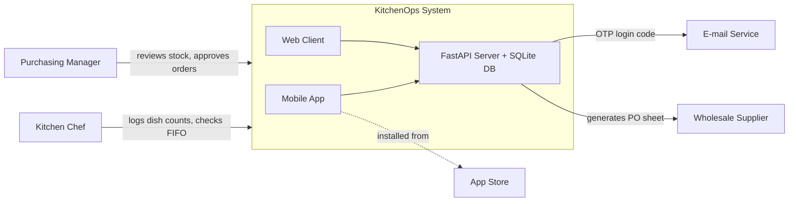

# Project Proposal

**AI-Assisted Software Development · Atlas University · Fall 2026–2027**

| | |
|---|---|
| **Student** | 220504045 · Anıl · Aydeniz |
| **Section** | en |
| **Project** | KitchenOps — commercial kitchen inventory depletion and smart restock logistics |

---

## Part A — What you will build (Week 2)

### 1. Title (about 80 characters)
KitchenOps — commercial kitchen inventory depletion and smart restock logistics

### 2. One-paragraph summary (about 400 characters)
KitchenOps is a mobile and web application for commercial restaurant and cafe kitchens that eliminates ingredient shortages and food spoilage through automated inventory logistics. It automatically deducts raw ingredient stocks whenever dishes are prepared based on standard recipe bills of materials, enforces FIFO batch rotation for expiring fresh goods, and generates instant purchase orders for wholesale suppliers when ingredient levels fall below safety thresholds. Kitchen managers track real-time food cost and waste analytics directly from the web dashboard.

### 3. Problem (about 600 characters)
Medium-sized commercial restaurants and cafes serving 150 to 400 covers daily lose 8% to 12% of their monthly revenue to food spoilage, unrecorded recipe over-portioning, and emergency stockouts. Today, head chefs conduct late-night inventory counts with clipboards and send informal WhatsApp voice notes to wholesale suppliers at 23:30. In 20 restaurants surveyed in the local dining district, kitchen staff consistently opened newly delivered crates of dairy and produce while older batches sat unnoticed at the back of the walk-in cooler until spoiled. When a critical ingredient like cooking cream or chicken breast runs out during peak dinner service, line cooks scramble to buy retail-priced substitutes from nearby grocery markets at a 40% premium, or 86 menu items altogether, resulting in dissatisfied patrons and wasted payroll.

### 4. Solution (about 600 characters)
KitchenOps replaces clipboard guesswork with an integrated inventory and supply chain engine. The kitchen chef logs daily prepared dish counts with one tap on mobile, and the server automatically deducts raw ingredients from the central walk-in stock based on calibrated recipe portion formulas. The system assigns batch dates to inbound crates, prioritizing older inventory using strict First-In, First-Out (FIFO) cues to prevent expiration waste. When any critical stock drops below its defined minimum threshold, KitchenOps automatically compiles an itemized wholesale supplier procurement sheet ready for one-click manager dispatch. Restaurant managers view daily ingredient burn rates, food waste metrics, and supplier costs on the web dashboard. KitchenOps deliberately does NOT process customer POS dining payments, handle kitchen display ticket routing, or manage delivery courier dispatch.

### 5. How it works (about 600 characters + one diagram)
Kitchen chefs and stockroom receivers use the mobile app to record ingredient deliveries, verify batch expiry dates, and log completed dish counts during prep service. Restaurant owners and purchasing managers use the web client to inspect real-time pantry inventory, configure recipe portion ratios, adjust safety thresholds, and approve wholesale supplier purchase orders. The server runs on FastAPI with SQLite, maintaining recipe bills of materials, ingredient stock levels, and automated replenishment queues while running a background scheduler that flags expiring batches every midnight. Kitchen staff authenticate securely using an OTP verification code sent via e-mail. Both mobile and web clients communicate exclusively through the server's REST API. No internal AI model runs in the base loop; lightweight recipe optimization advice runs on the server.

### 6. Technologies (about 300 characters)
Mobile: React Native with Expo (hybrid, Android/iOS ready). Web: Streamlit (Python 3.13 dashboard). Server: FastAPI (Python 3.13 REST backend). Database: SQLite (local relational store). Login e-mail: Resend / SMTP OTP service. Hosting: Render (free tier backend). Store: Google Play Store. AI: rule-based inventory optimization; future recipe adaptation via Claude API.

### 7. Success criteria (about 400 characters)
1. A kitchen chef logs 30 prepared pasta portions on the mobile app, and the server correctly deducts 3.6 kg pasta and 2.4 kg sauce from stock in under two seconds.
2. When ingredient stock drops below its safety threshold, an itemized supplier procurement order appears on the purchasing manager's web dashboard within three seconds.
3. In a five-day beta trial with two cafe test kitchens, zero critical ingredients run out during lunch service without an advance replenishment alert.
4. The FIFO batch tracker successfully flags perishable dairy items 48 hours before expiration with 100% notification accuracy.

---

## Part B — Why it is worth building (Week 3)

<!--
Part B is next week's work, together with the design. Read it now so you know where you
are going; write it in Week 3. The same StudyRoom examples continue.
-->

### 8. Market and target users (about 500 characters)
<!--
WHY: a product needs people who will actually use it. Knowing how many, and who, shapes
every decision after this.
WHAT: who exactly would use it; how many of them there are and how many you can reach; how
you found out — a number you counted, a question you asked twenty classmates, a source you
can name. Numbers with sources beat adjectives.
WEAK:   "Millions of students worldwide need this app."
STRONG: "About 3,000 students use the Atlas library each term (front desk, Oct 2026). I asked
         25 classmates: 19 had walked to the study rooms and found none free at least once
         this term; 21 said they would book on their phone. First users: this faculty's
         second- and third-year students, reachable through the class groups."
-->

### 9. Competitors (about 500 characters)
<!--
WHY: every problem is already solved somehow — badly, by hand, or by someone else. Knowing
how tells you what your product must do better.
WHAT: three existing products or workarounds that solve the same problem today. A paper
list, a spreadsheet or a WhatsApp group count. One or two lines each: name, what it does,
what it costs, what is wrong with it for your users.
WEAK:   "There are no competitors because this idea is new."
STRONG: "1. The paper list at the front desk — free, but only visible inside the library and
            full of no-shows.
         2. LibCal (Springshare) — room booking used by many university libraries; paid,
            the library would have to buy and run it.
         3. A class WhatsApp group where students say which room they are in — free,
            informal, nobody can reserve anything."
-->

### 10. Comparison and your advantage (about 500 characters)
<!--
WHY: this is the argument for switching. Without it, the reader asks "why not just use X?"
WHAT: a short table or list — your product against the three competitors on the three or
four criteria that matter to the USER (not to you): cost, can I see it from home, can I
reserve, what happens with no-shows. Then one sentence: why someone would switch to yours.
WEAK:   "Our app is better than all competitors in every way."
STRONG: a table with rows Paper list / LibCal / WhatsApp / StudyRoom and columns
         "see from home", "reserve", "frees no-shows", "cost to the library" — then:
         "StudyRoom is the only option that frees unused rooms automatically, and it costs
         the library nothing to run."
-->

### 11. Commercial potential (about 400 characters)
<!--
WHY: someone has to pay for the server — or decide it is worth running for free.
WHAT: how it would earn money or otherwise pay for itself: subscription, one-off price,
free with a paid tier, an internal tool that saves cost, sponsorship. A rough price and
why. A student project may be honest here: "no commercial intent; the value is X" is an
acceptable answer if you argue it.
WEAK:   "We will make money from ads."
STRONG: "Free for students. Offered to other university libraries at about 50 € a month
         per library, less than a paid booking system and with no set-up; hosting costs
         about 7 € a month. Honest limit: a library may prefer a product with support."
-->

### 12. Technical risks and how you will manage them (about 600 characters)
<!--
WHY: projects rarely fail on the code you know; they fail on the thing you did not plan for.
WHAT: the three things most likely to stop the project from reaching the store by Week 11 —
store review time, a device you do not own, an API you have never used, free hosting
limits — and for each: what you will do in advance, and what the fallback is.
The store you choose (S0) and why belongs here: name it, its fee, and its review or
test-track time.
WEAK:   "There are no major risks. We will work hard to finish on time."
STRONG: "1. Store: Google Play, 25 $ once; new personal accounts need a closed test with 12
            testers for 14 days, so the test track starts in Week 8, not Week 10. Fallback:
            Huawei AppGallery (free, a few days' review).
         2. QR check-in needs the camera: tested on my phone in Week 5; fallback, a
            four-digit code on the door.
         3. Free hosting sleeps after 15 minutes idle: first request slow; accepted, noted
            in the success criteria."
-->

---

## Change log
- 2026-10-06 — §4: added aggregate prep batch depletion mode and manager approval workflow based on peer review from 220504024 and 220504031.
