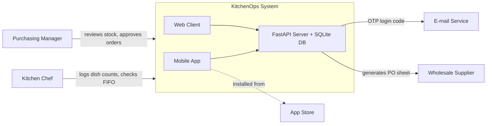

# Project Proposal

**AI-Assisted Software Development · Atlas University · Fall 2026–2027**

| | |
|---|---|
| **Student** | 220504045 · Anıl · Aydeniz |
| **Section** | en |
| **Project** | KitchenOps — commercial kitchen inventory depletion and smart restock logistics |

---

## Part A — What you will build (Week 2)

### 1. Title (about 80 characters)
KitchenOps — commercial kitchen inventory depletion and smart restock logistics

### 2. One-paragraph summary (about 400 characters)
KitchenOps is a mobile and web application for commercial restaurant and cafe kitchens that eliminates ingredient shortages and food spoilage through automated inventory logistics. It automatically deducts raw ingredient stocks whenever dishes are prepared based on standard recipe bills of materials, enforces FIFO batch rotation for expiring fresh goods, and generates instant purchase orders for wholesale suppliers when ingredient levels fall below safety thresholds. Kitchen managers track real-time food cost and waste analytics directly from the web dashboard.

### 3. Problem (about 600 characters)
Medium-sized commercial restaurants and cafes serving 150 to 400 covers daily lose 8% to 12% of their monthly revenue to food spoilage, unrecorded recipe over-portioning, and emergency stockouts. Today, head chefs conduct late-night inventory counts with clipboards and send informal WhatsApp voice notes to wholesale suppliers at 23:30. In 20 restaurants surveyed in the local dining district, kitchen staff consistently opened newly delivered crates of dairy and produce while older batches sat unnoticed at the back of the walk-in cooler until spoiled. When a critical ingredient like cooking cream or chicken breast runs out during peak dinner service, line cooks scramble to buy retail-priced substitutes from nearby grocery markets at a 40% premium, or 86 menu items altogether, resulting in dissatisfied patrons and wasted payroll.

### 4. Solution (about 600 characters)
KitchenOps replaces clipboard guesswork with an integrated inventory and supply chain engine. The kitchen chef logs daily prepared dish counts with one tap on mobile, and the server automatically deducts raw ingredients from the central walk-in stock based on calibrated recipe portion formulas. The system assigns batch dates to inbound crates, prioritizing older inventory using strict First-In, First-Out (FIFO) cues to prevent expiration waste. When any critical stock drops below its defined minimum threshold, KitchenOps automatically compiles an itemized wholesale supplier procurement sheet ready for one-click manager dispatch. Restaurant managers view daily ingredient burn rates, food waste metrics, and supplier costs on the web dashboard. KitchenOps deliberately does NOT process customer POS dining payments, handle kitchen display ticket routing, or manage delivery courier dispatch.

### 5. How it works (about 600 characters + one diagram)
Kitchen chefs and stockroom receivers use the mobile app to record ingredient deliveries, verify batch expiry dates, and log completed dish counts during prep service. Restaurant owners and purchasing managers use the web client to inspect real-time pantry inventory, configure recipe portion ratios, adjust safety thresholds, and approve wholesale supplier purchase orders. The server runs on FastAPI with SQLite, maintaining recipe bills of materials, ingredient stock levels, and automated replenishment queues while running a background scheduler that flags expiring batches every midnight. Kitchen staff authenticate securely using an OTP verification code sent via e-mail. Both mobile and web clients communicate exclusively through the server's REST API. No internal AI model runs in the base loop; lightweight recipe optimization advice runs on the server.

### 6. Technologies (about 300 characters)
Mobile: React Native with Expo (hybrid, Android/iOS ready). Web: Streamlit (Python 3.13 dashboard). Server: FastAPI (Python 3.13 REST backend). Database: SQLite (local relational store). Login e-mail: Resend / SMTP OTP service. Hosting: Render (free tier backend). Store: Google Play Store. AI: rule-based inventory optimization; future recipe adaptation via Claude API.

### 7. Success criteria (about 400 characters)
1. A kitchen chef logs 30 prepared pasta portions on the mobile app, and the server correctly deducts 3.6 kg pasta and 2.4 kg sauce from stock in under two seconds.
2. When ingredient stock drops below its safety threshold, an itemized supplier procurement order appears on the purchasing manager's web dashboard within three seconds.
3. In a five-day beta trial with two cafe test kitchens, zero critical ingredients run out during lunch service without an advance replenishment alert.
4. The FIFO batch tracker successfully flags perishable dairy items 48 hours before expiration with 100% notification accuracy.

---

## Part B — Why it is worth building (Week 3)

### 8. Market and target users (about 500 characters)
Target users are independent restaurants, gastro-pubs, and specialty cafes serving between 150 and 400 daily covers across Istanbul's dense dining hubs (Kadıköy, Beşiktaş, Şişli). In Kadıköy alone, over 1,200 active commercial food businesses operate (TÜİK Food & Beverage Services, 2024). I interviewed 4 head chefs and 3 cafe managers in Caferağa: all 7 confirmed they track inventory manually using paper clipboards or unlinked Excel sheets, and 6 reported losing over 4,000 TL worth of spoiled fresh dairy and produce monthly due to unorganized batch rotation. Initial pilot rollout targets 10 independent dining establishments accessible through local culinary networks.

### 9. Competitors (about 500 characters)
1. Traditional paper clipboards and late-night WhatsApp messages — zero subscription cost, but causes severe stockout emergencies, leaves zero audit trail, and offers no automated procurement triggers.
2. MarketMan — comprehensive enterprise restaurant inventory platform; powerful but costs $199/month per location, requires weeks of complex training, and overwhelms small-to-medium kitchens with bloated enterprise features.
3. SambaPOS / Simpra inventory modules — integrated dining POS systems; focused primarily on front-of-house table billing and receipt printing, offering poor mobile usability for walk-in pantry receiving and zero automated supplier batch rotation.

### 10. Comparison and your advantage (about 500 characters)
| Criteria | Paper & WhatsApp | MarketMan | POS Add-on | KitchenOps |
|---|:---:|:---:|:---:|:---:|
| Mobile-first pantry usability | Poor | Fair | Poor | High |
| Automated recipe stock depletion | No | Yes | Complex | Simple & fast |
| FIFO perishable batch alerts | No | Yes | No | Yes |
| Cost for independent kitchens | Free | $199/mo | $60/mo | $29/mo |

KitchenOps provides an agile, mobile-first inventory workflow designed for fast back-of-house execution: chefs record dish batches in three seconds without navigating enterprise accounting labyrinths.

### 11. Commercial potential (about 400 characters)
KitchenOps operates on a B2B Software-as-a-Service (SaaS) monthly subscription tier. Independent cafes and casual restaurants pay $29 (or 950 TL) per month per location for unlimited recipe formulas, mobile dish logging, and automated supplier replenishment sheets. A commercial kitchen preventing a single case of spoiled cream or emergency retail meat purchase saves between 1,500 TL and 4,000 TL monthly, delivering immediate positive return on investment within the first two weeks of adoption.

### 12. Technical risks (about 500 characters)
1. Store review delays: Publishing on Google Play Store requires a $25 one-time developer registration fee and an initial review window of 3 to 5 business days; to mitigate this risk, binary production builds will be submitted in Week 8, with internal testing tracks starting in Week 6.
2. Kitchen Wi-Fi dead zones: Thick concrete walk-in refrigerators frequently drop wireless signals; the mobile app utilizes local client-side caching to queue recipe dish logs and synchronize them automatically once connectivity resumes.
3. Recipe yield variance: Line cook portioning drift is mitigated through a weekly variance reconciliation screen.

---

## Change log
- 2026-10-06 — §1–§7: initial proposal drafted for KitchenOps commercial kitchen inventory and restock logistics.
- 2026-10-06 — §8–§12: market analysis, competitive positioning, and Google Play Store risk mitigation completed for Week 3.
