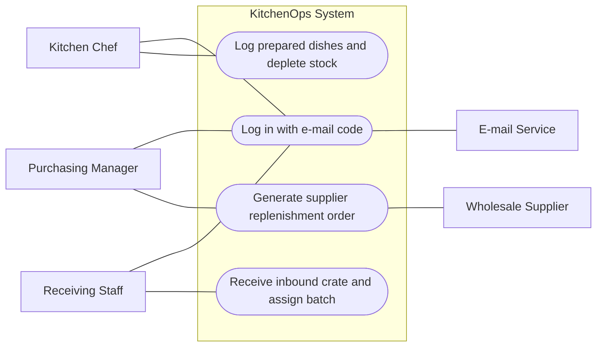

# Software Requirements Specification — KitchenOps

## 1. Purpose and scope

KitchenOps provides commercial restaurant, cafe, and catering kitchens with automated raw ingredient inventory tracking, recipe-driven stock depletion, FIFO batch rotation, and automated wholesale replenishment. It is designed for head chefs, stockroom receivers, and purchasing managers. KitchenOps deliberately does NOT process customer POS dining payments, handle kitchen display ticket routing, or manage delivery courier dispatch.

## 2. Actors

- Kitchen Chef — logs prepared dish portion counts on mobile, reviews recipe ingredient requirements, and follows FIFO batch recommendations.
- Purchasing Manager — reviews pantry balances on web, defines minimum threshold levels, and approves wholesale purchase orders.
- Receiving Staff — records inbound delivery crates on mobile and logs arrival and lot expiry dates.
- Wholesale Supplier — receives finalized purchase orders generated by the replenishment engine.
- E-mail Service — delivers the 4-digit OTP login verification code to kitchen staff.
- App Store — distributes and updates the production mobile application build.

## 3. Use cases

UC0 — Log in with e-mail code  
Actor: Kitchen Chef, Purchasing Manager. Requirements: REQ-001.  
Main flow:  
1. User enters company e-mail address on mobile or web client.  
2. Server generates a 4-digit one-time code and dispatches it via e-mail service.  
3. User enters the code within ten minutes to authenticate.  
What can go wrong: Wrong or expired code entered — user is alerted and access is denied.

UC1 — Log prepared dishes and deplete inventory  
Actor: Kitchen Chef. Requirements: REQ-002, REQ-004.  
Main flow:  
1. Chef selects prepared menu item (e.g., Penne Arrabbiata) and inputs portion count (e.g., 20).  
2. Server queries recipe bill of materials and deducts corresponding raw quantities (2.4 kg pasta, 1.6 kg sauce).  
3. Deductions draw from the oldest valid FIFO batch currently in stock.  
What can go wrong: Insufficient stock recorded in database — system records negative variance alert and warns chef.

UC2 — Generate and dispatch supplier replenishment order  
Actor: Purchasing Manager. Requirements: REQ-003.  
Main flow:  
1. Server detects ingredient stock dropping below safety threshold (e.g., cream below 5 liters).  
2. System automatically generates a replenishment line item in the active wholesale purchase order.  
3. Purchasing manager reviews draft order on web dashboard and confirms dispatch to wholesale supplier.  
What can go wrong: Manager edits order quantity before dispatch — server updates proposed replenishment amount.

UC3 — Receive inbound ingredient crate and assign batch  
Actor: Receiving Staff. Requirements: REQ-005, REQ-004.  
Main flow:  
1. Receiving staff scans or selects inbound ingredient crate on mobile upon delivery arrival.  
2. Staff inputs delivered weight/quantity and lot expiration date stamped on crate.  
3. Server creates new FIFO inventory batch and increments active stock balance.  
What can go wrong: Inbound item has expiration date in the past — mobile app flags invalid date and blocks entry.

## 4. Functional requirements

- REQ-001 — A new user signs up with an e-mail address and logs in with the 4-digit code sent to it; no passwords are stored. — must — UC0  
  Acceptance: The code arrives by e-mail within one minute; entering it within 10 minutes logs the user in; an expired or wrong code is refused with a message.

- REQ-002 — A kitchen chef logs prepared dish portions on mobile, and the server automatically deducts raw ingredient stocks based on the recipe bill of materials. — must — UC1  
  Acceptance: Logging 10 portions of a recipe containing 120g pasta and 80g sauce deducts exactly 1.2kg pasta and 0.8kg sauce from active stock, generating an audit log in under two seconds.

- REQ-003 — When an ingredient's stock level drops below its safety threshold, the server automatically appends the required replenishment quantity to the active supplier purchase order. — must — UC2  
  Acceptance: Cooking cream stock dropping below the 5-liter safety threshold triggers an automatic 20-liter replenishment entry in the pending supplier purchase order sheet.

- REQ-004 — The system tags inbound ingredient crates with batch arrival and expiration dates, enforcing First-In First-Out (FIFO) usage priority and alerting staff 48 hours prior to spoilage. — should — UC1, UC3  
  Acceptance: Batches expiring within 48 hours display an amber alert banner on mobile and web; recipes automatically draw quantities from the oldest unexpired batch.

- REQ-005 — A receiving staff member records inbound wholesale deliveries on mobile by entering quantities and lot dates, instantly incrementing warehouse inventory. — should — UC3  
  Acceptance: Submitting a received delivery of 25kg flour updates the active inventory count by 25kg and creates an inbound receipt record visible on the web dashboard.

## 5. Non-functional requirements

- REQ-006 — Every screen is usable on a phone about 390 px wide without horizontal scrolling. — must  
  Acceptance: Every screen opened on a 390 px wide phone (or the browser's phone view): no horizontal scroll bar, no text cut off, every button reachable.

- REQ-007 — Inventory stock deductions initiated from the mobile app synchronize and update the web dashboard inventory monitor within three seconds. — should  
  Acceptance: Confirming a dish preparation on mobile reflects the updated ingredient balance on the web client in under three seconds over standard Wi-Fi/4G.

- REQ-008 — The server API returns ingredient catalogs, active purchase orders, and stock levels in under 800 milliseconds for catalogs up to 500 items. — could  
  Acceptance: Querying the 200-item kitchen pantry inventory endpoint responds in under 800 milliseconds measured across twenty consecutive requests.

## 6. Constraints and assumptions

Published on Google Play Store; development and testing performed on an Android smartphone and Windows environment. Free tier hosting using Render for the FastAPI backend and SQLite database. System operates reliably during standard restaurant kitchen preparation and service hours (07:00 to 24:00).
