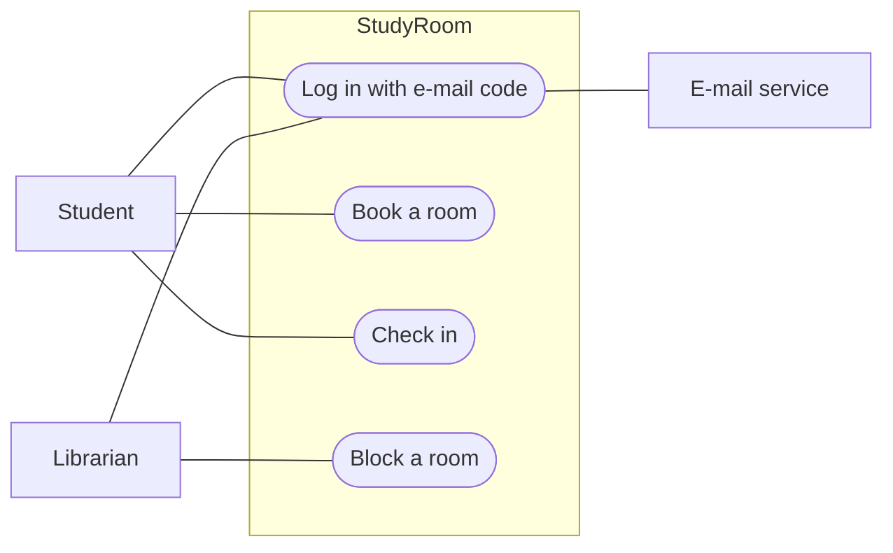

# Software Requirements Specification — *project title*

<!--
WHAT THIS DOCUMENT IS
The requirements of your product, written so that someone else could build it, and so
that you can test it in Week 9. PROPOSAL.md says why and what, in a few paragraphs; this
says exactly what the system must do. A page or two — not thirty.

RULES
- Keep the headings. Write under them.
- Requirement ids are the ones in requirements.json: REQ-001, REQ-002 … Every id there
  appears here, and nothing appears here that is not there. Ids never change after this
  week; design, tests and the traceability matrix all point at them.
- The examples in the comments describe one invented project, "StudyRoom" (booking a
  library study room). They show the level of detail wanted; write about your project.
  Comments are invisible on GitHub and not counted by the checker.
-->

## 1. Purpose and scope

<!--
WHAT: two or three sentences — what the system is for, who uses it, and what is outside
it. Copy the "does NOT do" sentence from PROPOSAL.md §4; scope is where it belongs.
EXAMPLE: "StudyRoom lets Atlas University students book the library's twelve study rooms
and lets the librarian manage the bookings. It covers study rooms only; computers, group
spaces, payments and the library catalogue are out of scope."
-->

## 2. Actors

<!--
WHAT: every kind of person and every outside system that interacts with yours, one line
each: who they are and what they want from the system. Include the e-mail/OTP service
that sends login codes, any third-party API, and the app store.
EXAMPLE:
- Student — finds a free room, books it, checks in.
- Librarian — sees the day's bookings, blocks a room for cleaning or an event.
- E-mail service — delivers the login code.
- App store — distributes the mobile app.
-->

## 3. Use cases

<!--
WHAT: at least three use cases. A use case is one thing an actor achieves, from start to
finish — "book a room", not "press the button". Write each one in this shape:

  UC1 — Book a room
  Actor: Student.  Requirements: REQ-002, REQ-003.
  Main flow: 1. The student opens the app, already logged in (UC0).
             2. The app shows today's rooms as free or busy, by hour.
             3. The student picks a free slot of up to two hours and confirms.
             4. The server stores the booking; the slot shows as busy for everyone.
  What can go wrong: the slot was taken a second earlier — the app says so and shows
             the next free slot; the student already has a booking at that time — refused.

Then ONE use case diagram in Mermaid, directly under this comment: the actors outside,
the use cases as rounded nodes UC([…]) inside a box that is your system. The checker counts
the ([…]) nodes: at least three. The block below is an example: replace every line of it
and delete the EXAMPLE line, or the checker treats it as missing.
-->

## 4. Functional requirements

<!--
WHAT: what the system does. One line per requirement, the same as in requirements.json:
id — description — priority — the use case it belongs to. Then its acceptance criterion
on the next line: the test that proves it is met.
EXAMPLE:
- REQ-002 — A student books a free slot of 30 to 120 minutes in a room. — must — UC1
  Acceptance: a booking for a free slot is saved and shown as busy on every client; a
  booking longer than 120 minutes or for a busy slot is refused with a message.
At least five.
-->

## 5. Non-functional requirements

<!--
WHAT: how well the system does it — speed, capacity, security, privacy, language,
availability, cost. Each with a number or a yes/no test, never an adjective alone.
"Fast" is not a requirement; "the free/busy screen loads in under two seconds on 4G" is.
One is fixed for everyone: every screen is usable on a phone about 390 px wide without
horizontal scrolling. Keep it.
EXAMPLE:
- REQ-008 — A booking made on one client is visible on every other client within five
  seconds. — must
  Acceptance: book on the phone, watch the web page; measured ten times, all under five seconds.
At least three.
-->

## 6. Constraints and assumptions

<!--
WHAT: what you take as given and cannot change — the store you will publish on, the
devices you own, the hosting you can afford, the model sizes your laptop can run, the
term calendar, rules of the organisation (the library's opening hours, say).
EXAMPLE: "Published on Google Play only; I own an Android phone and no Mac. Free hosting
tier (the server may sleep after 15 minutes idle). The library is open 08:30–22:00."
-->
